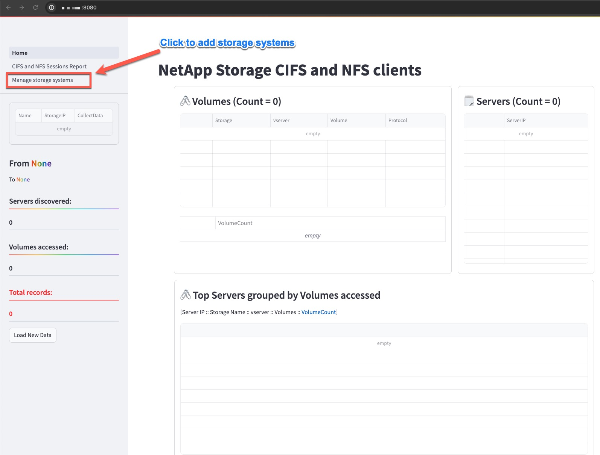
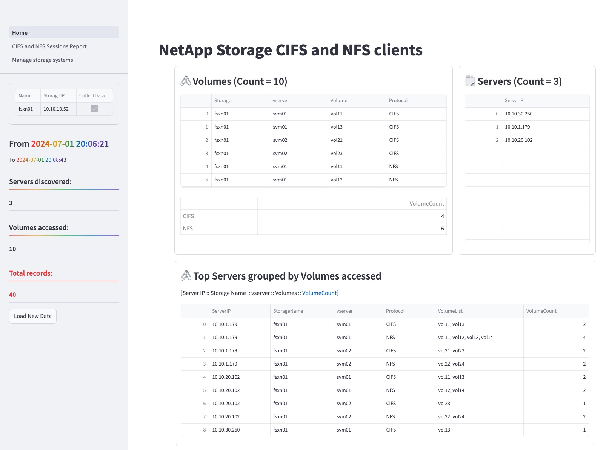

# Steps to setup NetApp CIFS and NFS Sessions data collector to support storage migrations

> Note: This NetApp Data collector solution requires a Linux host with Docker compute engine installed and the container created on this Linux host should be able to connect to https port of the NetApp Storage systems.

---
## Follow these steps when using Amazon Linux EC2 instance to connect to on-prem NetApp Storage systems and for Amazon FSx for NetApp ONTAP

1. Install docker engine if not installed on the linux host.
   ```bash
    sudo yum install -y docker
    ```
2. Enable docker service on the linux host used for this project and enable the non-root user to run docker container using the following commands. Then download docker-compose binary and restart the host.
    ```bash
    sudo systemctl enable docker
    sudo systemctl start docker
    sudo usermod -aG docker $USER
    sudo curl -L "https://github.com/docker/compose/releases/download/v2.27.0/docker-compose-linux-x86_64" -o /usr/bin/docker-compose
    sudo chmod +x /usr/bin/docker-compose
    sudo docker-compose --version
    sudo reboot
    ```
3. Verify the docker service is running by running *`docker info`*.
4. Verify the docker-compose is installed and is same or higher than version *v2.27.0* using this command `docker-compose -v`. (Docker Compose version v2.27.0)
5. Clone this git repository to this linux host and change directory to the cloned folder.
    ```
    git clone https://github.com/aws-samples/netapp-cifs-and-nfs-sessions-data-collector-workshop
    cd netapp-cifs-and-nfs-sessions-data-collector-workshop
    ```
   These should be the files present in the folder:
   ```
   ├── README.md
   ├── Setup.md
   ├── app
   │   ├── Dockerfile
   │   ├── Home.py
   │   ├── pages
   │   │   ├── 1_CIFS_and_NFS_Sessions_Report.py
   │   │   └── 99_Add_storage.py
   │   └── requirements.txt
   ├── collector.env
   ├── commons
   │   ├── __init__.py
   │   ├── database.py
   │   ├── encryptionKey.py
   │   ├── entrypoint.sh
   │   ├── netappCollector.py
   │   ├── setupDb.py
   │   └── streamlitDfs.py
   ├── database
   ├── docker-compose.yaml
   ├── logs
   │   ├── app.log
   │   ├── collector.log
   │   └── database.log
   └── output
   ```
6. Update the **collector.env** file: 
   1. Set SSL_VERIFY to `False`
   2. Set a secure string as `POSTGRES_PASSWORD`
   3. Set `DATA_COLLECTION_INTERVAL` to 600 or higher. This is refersh interval in seconds to query NetApp Storage systems to collect NFS clients and CIFS sessions details.
   ```
   SSL_VERIFY=False
   POSTGRES_PASSWORD=P0stGr3sP@ss
   DATA_COLLECTION_INTERVAL=600
   ```
7. Start NetApp data collector container using **`docker-compose up -d`**.
    ```
    docker-compose up -d
    ```   
8. Check the running containers and verify an ecryption.key is created in **output** folder.
   ```bash
   docker ps
   ls -lh output/
   ```
9. Docker ps command shows Postgres database running and listening on port `5432` and netappcollector running and listening on port `8080`.
   ```
   docker ps
   CONTAINER ID   IMAGE                 COMMAND                  CREATED          STATUS                            PORTS                                       NAMES
   1a6f56c74a33   netappcollector:1.1   "/bin/bash /usr/neta…"   10 seconds ago   Up 4 seconds (health: starting)   0.0.0.0:8080->8080/tcp, :::8080->8080/tcp   netappcollector
   2002208d0524   postgres:alpine3.20   "docker-entrypoint.s…"   10 seconds ago   Up 9 seconds (healthy)            0.0.0.0:5432->5432/tcp, :::5432->5432/tcp   postgres
   ```
10. User can now safely logout from this linux host.  
11. Start a web browser and connect to this linux host to port 8080. On first lauch you will see empty tables as shown in this figure below:  
     
12. Now click on Add Storage as highlighted to add new NetApp storage systems.  
13. Fill the form with NetApp Storage Details : **Name**, **IP Address**, **Username** and **Password**.  
      

14. Navigate to **Home** page to verify the data collection was successful.  
      

15. Add storage systems as needed.  

---
# Stopping data collection

1. SSH to the linux host.
2. Verify the container is still running with `docker ps` command.
3. Change directory to `netapp-cifs-and-nfs-sessions-data-collector-workshop`.
4. Run `docker-compose down` command to stop containers and data collection.